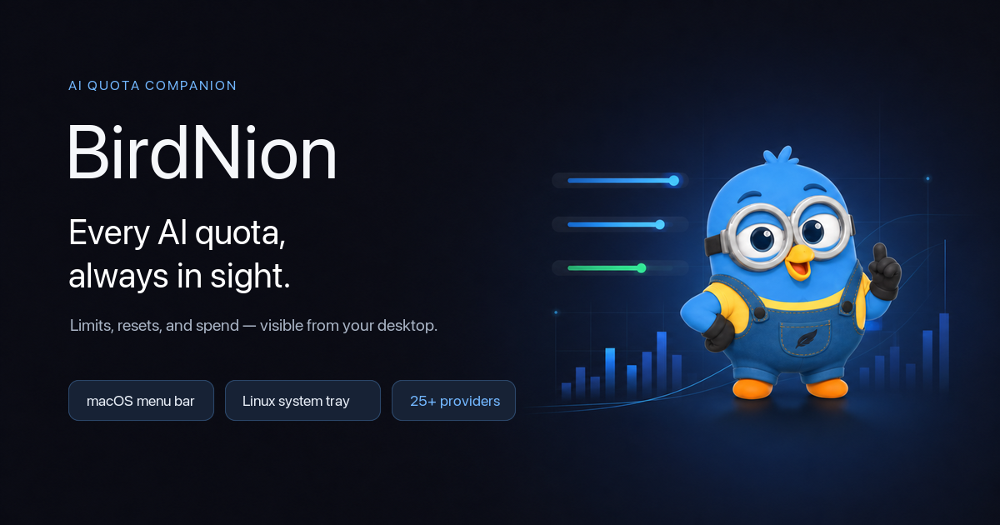
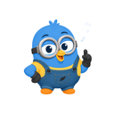
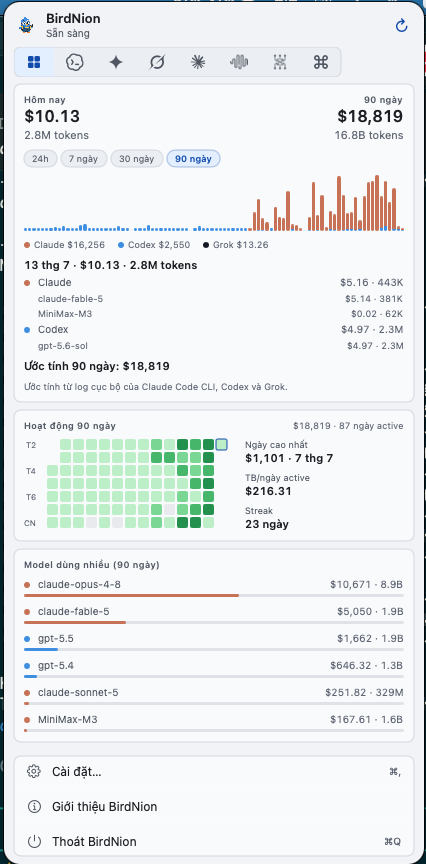
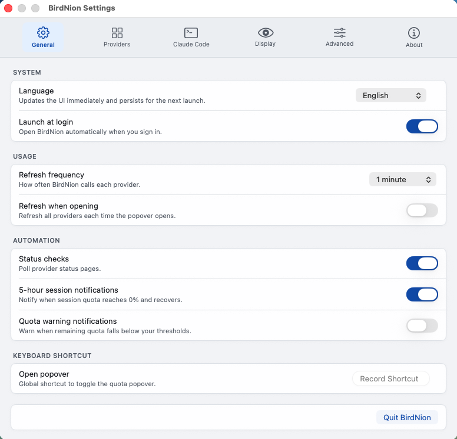

<div align="center">
  
</div>

# BirdNion - May your AI agents stay in budget.

> Every AI coding quota and agent setting, in your macOS menu bar or Linux system tray.

[](https://github.com/hapo-nghialuu/BirdNion/releases/latest)
[](https://github.com/hapo-nghialuu/BirdNion/releases/latest)
[](https://github.com/hapo-nghialuu/BirdNion/releases/latest)
[](https://github.com/hapo-nghialuu/homebrew-tap)
[](LICENSE)

25+ providers. BirdNion is a small macOS 14+ menu-bar app and Linux tray app that keeps AI coding limits visible, shows when each window resets, and centralizes how each coding agent is read. Codex, Claude, MiniMax, OpenRouter, DeepSeek, z.ai, ElevenLabs, Deepgram, Groq, Grok, OpenAI, Ollama, GitHub Copilot, Kilo, Command Code, Xiaomi MiMo, Alibaba/Qwen, Cursor, Gemini, Kiro, OpenCode, OpenCode Go, Antigravity, AWS Bedrock, and FreeModel.

The native macOS app uses SwiftUI/AppKit and a vendored, trimmed `CodexBarCore` subset. The Linux port lives in `linux/` and uses Tauri v2 with a Rust core and vanilla TypeScript UI. Both platforms share the same XDG provider configuration schema.

## Why

- **Plan around resets.** Per-provider 5-hour, weekly, monthly, credit, and budget windows with reset countdowns.
- **See spend and cost.** Claude local JSONL scans, Claude Admin API charts, Codex credits, OpenRouter balances, Bedrock budgets, and provider-specific cost/credit summaries where available.
- **Configure agent sources.** Pick OAuth, CLI, browser cookies, API keys, AWS credentials, local app files, or provider apps from Settings per provider.
- **Keep desktop chrome quiet.** macOS can rotate provider quota percents in the menu bar; Linux shows the same rotation in the tray tooltip.
- **Privacy-first.** BirdNion reuses existing sessions and explicit config. It does not store passwords or perform unrestricted disk scans.

## Install

### Requirements

- macOS 14+ (Sonoma)
- Linux x86_64 for the published `.deb`, `.rpm`, and `.AppImage` bundles

### GitHub Releases

Download pre-built bundles from [GitHub Releases](https://github.com/hapo-nghialuu/BirdNion/releases):

- `BirdNion-<version>.zip` - universal macOS app, ad-hoc signed.
- `BirdNion_<version>_amd64.deb` - Ubuntu/Debian package.
- `BirdNion-<version>-1.x86_64.rpm` - Fedora/RHEL package.
- `BirdNion_<version>_amd64.AppImage` - portable Linux bundle.
- SHA256 is used by the Homebrew cask.
- The cask postflight removes the Gatekeeper quarantine flag from the staged app. If macOS still blocks the first launch, use Right-click -> Open.

### macOS via Homebrew

Recommended install command:

```bash
brew install --cask hapo-nghialuu/tap/birdnion
```

The fully-qualified command explicitly selects `hapo-nghialuu/tap/birdnion`, so a separate `brew tap` step is not required.

Short-name flow after tapping:

```bash
brew tap hapo-nghialuu/tap
brew trust --cask hapo-nghialuu/tap/birdnion
brew install --cask birdnion
```

Or trust the whole tap:

```bash
brew trust hapo-nghialuu/tap
brew install --cask birdnion
```

Do not use `HOMEBREW_NO_REQUIRE_TAP_TRUST=1` as the normal install path. It is a user-side environment override and cannot be placed inside `Casks/birdnion.rb` to bypass trust before Homebrew loads the cask.

### Update macOS

```bash
brew update && brew upgrade --cask birdnion
```

Run `brew update` first (chained with `&&`) so the tap pulls the newest cask —
`brew upgrade` alone does not refresh a third-party tap and will report
"already installed" against the stale version.

Verify the installed version:

```bash
brew list --cask --versions birdnion   # or: brew info --cask birdnion
```

### Linux

Download one of the Linux assets from [the latest release](https://github.com/hapo-nghialuu/BirdNion/releases/latest):

```bash
sudo apt install ./BirdNion_<version>_amd64.deb
# or
sudo dnf install ./BirdNion-<version>-1.x86_64.rpm
# or
chmod +x BirdNion_<version>_amd64.AppImage
./BirdNion_<version>_amd64.AppImage
```

### First run

- Open BirdNion from the macOS menu bar or Linux system tray.
- Open Settings -> Providers and enable what you use.
- Install or sign in to the provider sources you rely on: CLIs, browser sessions, OAuth/device flow, API keys, local app files, or cloud credentials depending on the provider.
- Optional: set provider account labels, menu-bar visibility, refresh intervals, cookie source, region, AWS auth mode, Kilo org scope, Copilot enterprise host, or provider-specific menu-bar metric.

## Agent Settings Config

BirdNion is meant to become a lightweight settings/config console for AI coding agents, not only a quota viewer.

What exists today:

- Provider enablement, order, account labels, refresh intervals, and menu-bar visibility.
- Source selectors for providers that can read from OAuth, CLI, browser cookies, Admin API, or local app state.
- Provider-specific settings for cookie mode, manual cookie headers, MiniMax/z.ai/Alibaba regions, AWS keys/profile/region, Deepgram Project ID, Kilo organization scope, Copilot enterprise host, and menu-bar metric selection.
- Local session discovery for agents that own their auth state: Claude Code, Codex CLI, Gemini CLI, Kiro, Cursor, Antigravity, and similar tools.
- A Claude Code config console for preset/custom backends, model tiers, global or project scope, JSON import, and safe removal of BirdNion-managed environment keys.
- Multi-account discovery and switching for Codex and FreeModel, including per-browser FreeModel sessions.

Planned direction:

- Extend profile management beyond Claude Code to more coding agents.
- Surface richer login/source health for each agent.
- Validate local config paths and CLI availability.
- Provide bootstrap hints for Claude Code, Codex CLI, Gemini CLI, Kiro, and future agents.
- Keep BirdNion preferences in BirdNion's config layer while leaving each agent's credential store untouched.

## Providers

- **Codex** - OAuth API from `~/.codex/auth.json`, API-key fallback, local `codex app-server` fallback, service status, version, credits, reset credits, optional OpenAI web extras, and managed account switching.
- **Claude** - OAuth API, browser cookies, CLI, or Admin API; 5-hour/weekly/Opus/Sonnet windows, local cost scans, web extras, and admin 30-day chart.
- **MiniMax** - API token, environment token, or cookie fallback for coding-plan usage, plan name, points/subscription, and global/CN region.
- **OpenRouter** - API token for prepaid credits plus optional per-key spending limit.
- **DeepSeek** - API token for USD/CNY balance with paid/granted split and low-balance warning.
- **z.ai** - API token with global/CN region for quota limits and computed remaining percentage.
- **ElevenLabs** - API key for character credits, voice slots, professional voices, plan, and subscription status.
- **Deepgram** - API key with optional Project ID for usage summaries and aggregate-all-project mode.
- **Groq** - API key for Prometheus-backed request, token, and cache-hit metrics.
- **Grok** - Zero-config from `~/.grok/auth.json` (`grok login`); CLI `x.ai/billing` RPC then grok.com billing gRPC-web via Chrome cookies / auth bearer; SuperGrok identity and credit windows. Local cost on the All tab from `~/.grok/sessions/**/signals.json` (token totals × blended model price table).
- **OpenAI** - Platform Admin API (`OPENAI_ADMIN_KEY` / config) for org spend Today/7d/30d; optional Project ID; legacy credit-grants fallback for user API keys. Not ChatGPT/Codex subscription (use Codex for that).
- **Ollama** - Cloud Session/Weekly usage via ollama.com cookies (Auto/Manual); optional `OLLAMA_API_KEY` verifies Cloud API access.
- **GitHub Copilot** - GitHub Device Flow or PAT fallback, enterprise host, premium usage, username, and budget extras via web cookies.
- **Kilo** - API token or CLI session, Kilo organization scope, credits, and auto top-up details.
- **Kiro** - CLI-based usage, credits/overage data, and 9 menu-bar display modes.
- **Command Code** - Browser or manual cookies for billing credits and plan catalog.
- **Xiaomi MiMo** - Browser cookies for balance, token-plan details, and usage.
- **Alibaba/Qwen** - Browser cookies plus intl/CN region for coding-plan and token-plan windows.
- **Cursor** - Cursor `state.vscdb` first, browser cookies as fallback, usage summary, identity, and request usage.
- **Gemini** - Gemini CLI OAuth credentials from `~/.gemini/oauth_creds.json` for Cloud Code Assist quota tiers.
- **OpenCode** - Browser cookies for rolling/weekly usage and subscription renewal.
- **OpenCode Go** - Browser cookies plus Go workspace page for rolling/weekly/monthly usage and Zen balance.
- **Antigravity** - Local process/CLI probe and Google OAuth account store for quota buckets and account-matched data.
- **AWS Bedrock** - AWS access keys or named profile, region, budget fields, and CloudWatch/Cost usage.
- **FreeModel** - Browser sessions from `freemodel.dev` for 5-hour and weekly dollar budgets, with per-browser account switching and managed-cookie support.

Open to more providers when they fit the existing `QuotaProvider` model.

## Icon & Screenshots

The macOS menu-bar icon is the BirdNion bird by default. When "Show percent in menu bar" is enabled, the bar rotates through active provider quota percents with each provider's logo. Linux keeps the tray icon stable and exposes the rotating provider value in its tooltip.

<div align="center">
  
  <br />
  <strong>BirdNion app icon</strong>
</div>

<br />

<div align="center">
  
  <br />
  <strong>Usage and cost overview</strong>
</div>

<br />

<div align="center">
  
  <br />
  <strong>General settings</strong>
</div>

## Features

- Optional rotating provider values in the macOS menu bar or Linux tray tooltip, with provider toggles and drag-to-reorder Settings.
- Provider-specific usage meters with reset countdowns.
- Progressive refresh: each provider publishes as soon as its fetch completes.
- Last-known data stays visible while refreshes are in flight.
- Provider source selectors for OAuth, CLI, web cookies, Admin API, local app state, and static keys.
- Per-provider refresh intervals and menu-bar visibility.
- Cookie-source picker with Auto, Manual, and Off modes for cookie-backed providers.
- Claude, Codex, and Grok local cost charts with persistent high-water history. Stored bars seed the UI immediately while a narrower live scan refreshes recent days.
- Claude Admin API 30-day chart and Codex web dashboard extras where enabled.
- Kiro custom display values: credits left, percent, used/total, and overage modes.
- Quota and provider-failure notifications with configurable thresholds.
- XDG config file with restrictive permissions.

## Config And Storage

| Data | Location |
|---|---|
| Provider list, enabled flags, API keys, region, budget, project ID, base URL, account label | `~/.config/birdnion/settings.json` |
| Config override | `$BIRDNION_CONFIG` |
| XDG override | `$XDG_CONFIG_HOME/birdnion/settings.json` |
| Legacy config | `~/.birdnion/settings.json` |
| Codex OAuth | `~/.codex/auth.json`, owned by Codex CLI |
| Claude OAuth | macOS Keychain item `Claude Code-credentials`; Linux `~/.claude/.credentials.json`; both owned by Claude Code/CLI |
| Gemini OAuth | `~/.gemini/oauth_creds.json` |
| Cursor session | macOS: `~/Library/Application Support/Cursor/User/globalStorage/state.vscdb`; Linux: `~/.config/Cursor/User/globalStorage/state.vscdb` |
| Antigravity OAuth accounts | `~/.config/birdnion/antigravity-oauth.json` |
| Copilot OAuth accounts | `~/.config/birdnion/copilot-accounts.json` |
| FreeModel managed accounts | macOS: `~/Library/Application Support/BirdNion/freemodel-accounts.json`; Linux: `~/.config/birdnion/freemodel-accounts.json` |
| Daily cost history (All tab) | `~/.config/birdnion/cost-history.json` (sibling of settings; high-water merge so deleted Claude/Codex/Grok sessions keep past bars) |
| macOS UI preferences | `UserDefaults` (`showPercentInMenuBar`, visibility, refresh, source, and display settings) |
| Linux UI preferences | Tauri WebView `localStorage`; provider cookie/visibility/refresh fields remain in `settings.json` |

Config path priority:

1. `$BIRDNION_CONFIG`
2. `$XDG_CONFIG_HOME/birdnion/settings.json`
3. `~/.config/birdnion/settings.json`
4. `~/.birdnion/settings.json`

The config file is written atomically and set to permission `0600`.

## Privacy Note

BirdNion does not perform an unrestricted filesystem crawl. It reads documented locations only when the related provider/source is enabled: provider config files, CLI auth files, browser cookie stores, local IDE databases, and Claude/Codex/Grok session logs. Provider tokens live in the BirdNion config file with restrictive permissions. OAuth, Keychain, and CLI session files remain owned by their original tools.

No passwords are stored. Browser cookies are reused only when the user chooses a cookie-backed source.

## Platform Notes

### macOS permissions

- **Full Disk Access** - not required for the core app. Browser-cookie providers may need additional macOS access depending on the browser and cookie store.
- **Keychain access** - Claude OAuth may read the `Claude Code-credentials` item owned by Claude Code/CLI; browser cookie import may also trigger browser Safe Storage keychain prompts.
- **Files & Folders prompts** - local provider probes can trigger macOS prompts if the underlying CLI/helper touches protected locations.
- **What BirdNion does not request in the background** - no Screen Recording or Accessibility permission.

### Linux

- Browser-cookie providers require a supported Chrome/Chromium/Brave/Edge/Firefox profile and may depend on the desktop keyring.
- The system tray exposes quota rotation through its tooltip because Linux desktops do not provide portable text beside tray icons.
- Global hotkeys are not enabled on Linux; use the app window and Settings controls.

## Docs

- [docs/build.md](docs/build.md) - build, signing, and troubleshooting.
- [docs/system-architecture.md](docs/system-architecture.md) - system architecture and historical decision log.
- [docs/development-roadmap.md](docs/development-roadmap.md) - historical roadmap.
- [docs/provider-parity/README.md](docs/provider-parity/README.md) - BirdNion vs CodexBar parity audit.
- [docs/linux-parity-matrix.md](docs/linux-parity-matrix.md) - macOS/Linux feature parity.
- [linux/README.md](linux/README.md) - Linux development, packaging, and platform notes.

## Getting Started (Dev)

- Clone the repo. Open `BirdNion.xcodeproj` for macOS or work from `linux/` for Tauri development.
- Launch once, then toggle providers in Settings -> Providers.
- Install or sign in to the provider sources you rely on: CLIs, browser cookies, OAuth/device flow, API keys, provider apps, or local config files.
- Optional: set OpenAI cookies for Codex dashboard extras and Claude source routing for OAuth/Web/CLI/Admin API.

## Build From Source

### macOS

Requires macOS 14+ and Xcode with Swift support for the project scheme.

```bash
xcodebuild test -project BirdNion.xcodeproj -scheme BirdNion \
  -configuration Debug -destination 'platform=macOS'

xcodebuild build -project BirdNion.xcodeproj -scheme BirdNion \
  -configuration Release -destination 'platform=macOS'
```

BirdNion vendors a trimmed `CodexBarCore` package in `Vendor/CodexBar`; no external `~/Desktop/CodexBar` checkout is required.

### Linux

Development and tests can run from `linux/` on macOS or Linux. Native Linux bundles must be built on Linux with the WebKitGTK/AppIndicator dependencies installed.

```bash
cd linux
npm ci
npm run build
cargo test --manifest-path src-tauri/Cargo.toml

# On Linux: build .deb, .rpm, and AppImage bundles
npm run tauri build
```

## Credits

Inspired by [CodexBar](https://github.com/steipete/CodexBar), especially the idea of keeping every AI coding limit visible without opening a dashboard. BirdNion keeps its own cross-platform provider, configuration, and distribution surface.

## License

MIT.
