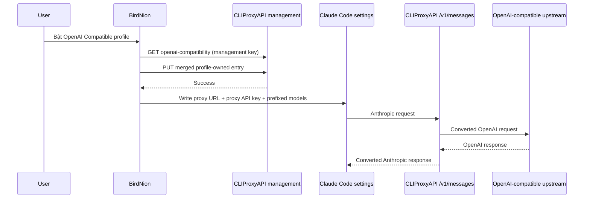

# Thiết kế: Claude Code OpenAI Compatibility

## Overview

BirdNion mở rộng custom Claude Code profile bằng protocol mode. `Anthropic Compatible` giữ nguyên contract hiện tại. `OpenAI Compatible` tích hợp với một CLIProxyAPI đã chạy, không nhúng binary Go vào ứng dụng.

## Goals

- Cho phép dùng OpenAI-compatible upstream với Claude Code qua CLIProxyAPI.
- Không thay đổi preset provider hoặc behavior profile Anthropic hiện hữu.
- Không làm lộ upstream/management secret trong Claude settings.

## Non-Goals

- BirdNion không cài, khởi chạy, restart hoặc cập nhật CLIProxyAPI.
- Không tạo Linux implementation trong scope này.
- Không tự xóa remote proxy entry.

## Architecture

## Canonical Contracts & Invariants

| Contract Area | Canonical Decision | Must Stay Consistent In |
|---|---|---|
| Mode persistence | `compatibilityMode == nil` means Anthropic direct | Config store, form, writer |
| Proxy ownership | Entry name/prefix is stable `birdnion-<profile-id>` | Client, writer |
| Proxy registration | GET all entries then PUT merged list; only replace matching BirdNion-owned entry | CLIProxyAPI client |
| Claude Code env | OpenAI mode writes proxy URL/proxy API key and prefix-qualified model aliases | Config writer |
| Secret boundary | Upstream key + management key stay in BirdNion config only | Client, writer, tests |

## Components

| Component | Role |
|---|---|
| `BirdNionConfigStore.ClaudeCodeProfile` | Persist mode-specific values without breaking old JSON. |
| `CLIProxyAPIClient` | Typed GET/PUT client for management API; no process lifecycle management. |
| `ClaudeCodeConfigWriter` | Builds direct or proxy-targeting Claude Code env. |
| `ClaudeCodeCustomProfileForm` | Shows protocol selector and mode-specific fields. |
| `ClaudeCodePane` | Registers proxy before writing Claude Code config. |

## Error Handling

- Missing fields: profile remains `Setup`; no network call.
- Invalid proxy URL, network, non-2xx, or invalid management JSON: expose a concise error; do not write Claude Code settings.
- Existing non-BirdNion management entries: preserve them exactly when PUTting merged list.
- No automatic remote deletion: avoids removing a proxy configuration that may be shared outside BirdNion.

## Testing Strategy

- URLProtocol XCTest: GET/PUT contract, auth header, full-list preservation, no secret leakage in generated payload.
- Writer XCTest: direct profile output unchanged; OpenAI profile output uses proxy values and prefixed aliases.
- Build/test: `xcodebuild test` on macOS with required HAPO build environment.
