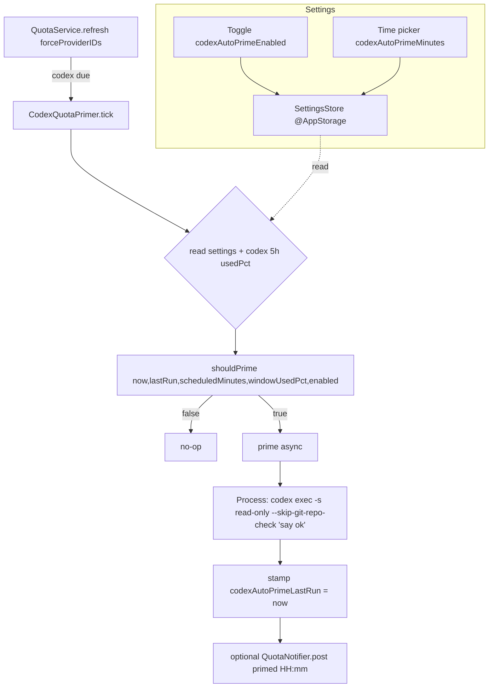
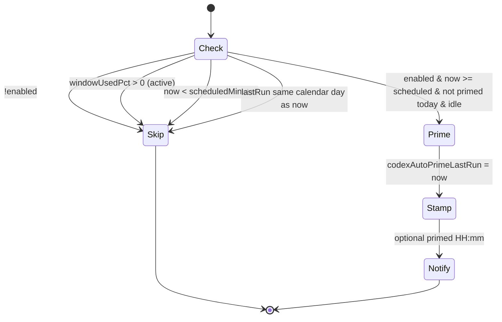

# Design Document — codex-quota-auto-prime

## Overview

**Purpose**: Deliver an opt-in scheduled "prime" that activates the Codex 5-hour rate-limit window by issuing one small `codex exec` request, so the reset cycle aligns with the user's working hours.

**Users**: Codex CLI users of BirdNion who want their 5h window to start at a predictable time each day.

**Impact**: Adds three `@AppStorage` settings, a small Settings UI block in the Codex provider detail, a new `CodexQuotaPrimer` type hosted inside the existing `CodexAccountStore.swift`, and one `tick()` call inside `QuotaService.refresh(...)`. No existing signatures change. Default-off.

### Goals
- Pure, unit-testable decision (`shouldPrime`) with catch-up and idle-skip.
- Safe, off-main `codex exec` executor using the existing `Process` idiom.
- Zero new polling loops — reuse the refresh cadence.
- vi+en localized UI and notification.

### Non-Goals
- Redeem/POST of Codex reset-credit (different mechanism, out of scope).
- Priming multiple accounts.
- Waking a sleeping machine.
- Any change to `ProviderStatus`/`QuotaProvider` signatures or the codex-account-switcher feature.
- New third-party dependencies or new `.swift` files.

## Architecture

### Existing Architecture Analysis
- `QuotaService` (`@MainActor`) drives all provider refreshes via `refresh(forceProviderIDs:)` and already runs a codex-only branch (`if due.contains(where: { $0.id == "codex" })`) — the exact hook point for `tick()`.
- `CodexAccountStore` owns codex process spawning (`codexBinary()`, `runLogin(...)`) and the `~/.codex/auth.json` identity — the natural host for `CodexQuotaPrimer`.
- `QuotaNotifier.post(id:title:body:)` + `import UserNotifications` already exist in `QuotaService.swift`.
- Settings use `@AppStorage` (`SettingsStore.swift`) + `SettingsLabeledRow`/`SettingsCard` (`SettingsSceneRoot.swift`) rendered in `ProvidersPane.swift` under `if rows[idx].id == "codex"`.

### Architecture Pattern & Boundary Map



**Architecture Integration**:
- Selected pattern: pure-core + thin-shell. `shouldPrime` is a pure function; `tick()`/`prime()` are the impure shell that reads settings/state and spawns the process.
- Domain boundaries: decision logic (pure) vs. process execution (shell) vs. UI (settings) vs. wiring (QuotaService).
- Existing patterns preserved: off-main `Process` spawn, `QuotaNotifier`, `@AppStorage`, `SettingsLabeledRow`, `L10n` vi+en.
- New components rationale: exactly one new type (`CodexQuotaPrimer`), hosted in an existing file to avoid pbxproj edits.

### Technology Stack

| Layer | Choice / Version | Role in Feature | Notes |
|-------|------------------|-----------------|-------|
| Frontend / CLI | SwiftUI (macOS 14+) | Settings toggle + DatePicker | Reuse `SettingsLabeledRow` |
| Backend / Services | Swift, Foundation `Process` | `CodexQuotaPrimer.tick/prime` | Hosted in `CodexAccountStore.swift` |
| External CLI | `codex-cli 0.143.0` | `codex exec -s read-only --skip-git-repo-check` | Never `--dangerously-*` |
| Data / Storage | `@AppStorage` (UserDefaults) | 3 keys | No new store |
| Notifications | `UserNotifications` | prime confirmation | Reuse `QuotaNotifier` |

## Canonical Contracts & Invariants

These decisions are inherited **verbatim** by every task that touches them.

| Contract Area | Canonical Decision | Applies To | Must Stay Consistent In |
|---------------|--------------------|------------|-------------------------|
| Settings keys | `codexAutoPrimeEnabled: Bool = false`, `codexAutoPrimeMinutes: Int = 535`, `codexAutoPrimeLastRun: Double = 0` | `SettingsStore.swift` | R1 UI, R2 executor stamp, R3 tick |
| Idle-skip rule | Only prime when the 5h window is idle. Active window = `windowUsedPct != nil && windowUsedPct > 0` → skip. | `shouldPrime`, `tick` | R2, R3 |
| Catch-up rule | Prime when `enabled && now ≥ scheduledMinutes(today) && not primed today && window idle`. Same logic serves on-time and after-miss. | `shouldPrime` | R2, R3 |
| Safe invocation | `codex exec -s read-only --skip-git-repo-check "<trivial prompt>"`, current `~/.codex` (no `CODEX_HOME`), off-main. NEVER `--dangerously-bypass-approvals-and-sandbox` / `danger-*`. | `prime()` | R2, R5 |
| Dedup | `codexAutoPrimeLastRun` compared to `now` by calendar day via `Calendar.current.isDate(_:inSameDayAs:)`. Stamp after spawn attempt. At most one prime/day. | `shouldPrime`, `prime`, `tick` | R2, R4 |

### Machine-checkable contract

<!-- contract:ShouldPrimeSignature -->
```swift
// Pure decision: no I/O, no ambient Date(); `now` is injected.
// windowUsedPct: nil or 0 => idle (may prime). >0 => active (skip).
func shouldPrime(now: Date,
                 lastRun: Double,          // epoch seconds; 0 = never
                 scheduledMinutes: Int,    // 0..1439 minutes since midnight
                 windowUsedPct: Int?,      // codex 5h usedPct; nil = unknown/idle
                 enabled: Bool) -> Bool
```

Every task that produces or consumes this signature adds `Contracts: ShouldPrimeSignature` and copies this block verbatim.

## System Flows

Decision gate (evaluated inside `tick()` on each awake codex refresh):



Gating notes: the four skip conditions short-circuit cheaply before any process spawn. Catch-up is implicit — if the machine was asleep at the scheduled minute, the first awake refresh after the scheduled time still satisfies `now >= scheduledMinutes && not primed today` and primes once.

## Requirements Traceability

| Requirement | Summary | Components | Interfaces | Flows |
|-------------|---------|------------|------------|-------|
| 1.1–1.3 | Settings keys | `SettingsStore` | `@AppStorage` | Settings |
| 1.4–1.6 | Codex Settings UI | `ProvidersPane` codex block | `SettingsLabeledRow`, `DatePicker`, `L10n` | Settings |
| 2.1–2.6 | Pure decision | `CodexQuotaPrimer.shouldPrime` | `ShouldPrimeSignature` | Decision gate |
| 2.7–2.10 | Safe executor | `CodexQuotaPrimer.prime` | `Process`, `@AppStorage` stamp | Prime |
| 3.1–3.3 | Refresh wiring + catch-up | `QuotaService.refresh` → `tick` | `CodexQuotaPrimer.tick` | Boundary map |
| 3.4–3.5 | Notification + no secret logs | `QuotaNotifier`, `L10n` | `post(id:title:body:)` | Notify |
| 4.1–4.3 | Perf/reliability | `prime` off-main, dedup | `Task.detached` | Prime |
| 5.1–5.3 | Security/opt-in | `prime` flags, default off | `-s read-only` | Prime |

## Components and Interfaces

| Component | Domain/Layer | Intent | Req Coverage | Key Dependencies | Contracts |
|-----------|--------------|--------|--------------|------------------|-----------|
| `SettingsStore` (extended) | Services | 3 new `@AppStorage` keys | 1.1–1.3 | UserDefaults | State |
| Codex Settings UI block | Views | Toggle + time picker | 1.4–1.6 | `SettingsLabeledRow`, `L10n` | State |
| `CodexQuotaPrimer` | Providers/Codex | Decision + executor + tick | 2.x, 3.1–3.3, 4.x, 5.x | `codexBinary()`, `Process`, `SettingsStore` | Service, `ShouldPrimeSignature` |
| `QuotaService` (wiring) | Services | Call `tick()` on codex path | 3.1–3.4 | `CodexQuotaPrimer`, `QuotaNotifier` | Service |

### Providers/Codex

#### CodexQuotaPrimer (new type in `CodexAccountStore.swift`)

| Field | Detail |
|-------|--------|
| Intent | Decide + execute the daily prime |
| Requirements | 2.1–2.10, 3.1–3.3, 4.1–4.3, 5.1–5.3 |

**Responsibilities & Constraints**
- `shouldPrime(...)` is pure (no I/O, no ambient `Date()`), per `ShouldPrimeSignature`.
- `prime() async` spawns `codex exec` off-main against current `~/.codex`, then stamps `codexAutoPrimeLastRun`.
- `tick(...)` reads settings + codex 5h `usedPct`, calls `shouldPrime`, and awaits `prime()` when true.
- Never logs credential/token/response content; never uses a dangerous sandbox flag.

**Contracts**: Service [x] / State [x]

##### Service Interface
```swift
enum CodexQuotaPrimer {
    // Contracts: ShouldPrimeSignature
    static func shouldPrime(now: Date, lastRun: Double, scheduledMinutes: Int,
                            windowUsedPct: Int?, enabled: Bool) -> Bool

    // Reads current ~/.codex; spawns `codex exec -s read-only --skip-git-repo-check "<prompt>"`
    // off-main; stamps codexAutoPrimeLastRun = now on completion. No-op if binary missing.
    static func prime(now: Date) async

    // Called once per codex refresh cycle from QuotaService.
    static func tick(windowUsedPct: Int?, now: Date) async
}
```
- Preconditions: none for `shouldPrime`; `tick` reads `@AppStorage` keys.
- Postconditions: on a true decision, exactly one `codex exec` spawn + `codexAutoPrimeLastRun` stamp.
- Invariants: at most one prime per calendar day; no dangerous sandbox; opt-in only.

##### State Management
- State model: 3 `@AppStorage` keys. `codexAutoPrimeLastRun` is the dedup cursor.
- Persistence: UserDefaults via `@AppStorage`. `tick` may read keys directly from `UserDefaults.standard` (matching `cliSwitchedID()` idiom) to stay off the `@MainActor` SettingsStore instance where convenient.
- Concurrency: `prime()` uses `Task.detached(priority:.userInitiated)` exactly like `runLogin`.

**Implementation Notes**
- Integration: `QuotaService.refresh` calls `await CodexQuotaPrimer.tick(windowUsedPct:now:)` on the codex-due branch.
- Validation: `shouldPrime` unit-tested for all six R2 cases.
- Risks: transient `usedPct==0` after reset — dedup caps to one prime/day.

## Data Models

No persistent schema. Three UserDefaults keys (see Canonical Contracts). `codexAutoPrimeMinutes` encodes a `DatePicker(.hourAndMinute)` selection as `hour*60 + minute`.

## Error Handling

### Error Strategy
- Missing `codex` binary → `prime()` returns without spawning or stamping (mirrors `runLogin`'s `guard let binary` no-op).
- Spawn/`run()` throw → swallow (best-effort), no crash, no stamp so a later tick can retry same day only if still idle and not stamped.
- No error surfaced to UI; the feature is silent except the optional success notification.

### Error Categories and Responses
- **User Errors**: none (no user input beyond toggle/time).
- **System Errors**: process spawn failure → best-effort swallow + continue refresh.
- **Business Logic Errors**: window active or already primed → intentional skip, not an error.

### Monitoring
- Use `os.Logger` (as elsewhere in `QuotaService`) for a redacted info line ("codex prime: scheduled/skip/done") with NO token/response content.

## Testing Strategy

### Unit Tests (`BirdNionTests/CodexProviderTests.swift`)
- `shouldPrime` on-time + idle → true.
- `shouldPrime` window active (`usedPct > 0`) → false.
- `shouldPrime` already primed today (`lastRun` same day) → false.
- `shouldPrime` before scheduled time → false.
- `shouldPrime` past scheduled + not primed today + idle → true (catch-up).
- `shouldPrime` disabled → false.

### Integration / Reachability
- Build the app (`xcodebuild build`).
- Verify `CodexQuotaPrimer.tick(...)` is invoked from `QuotaService.refresh(...)` (grep/trace) so the new type is reachable from the runtime path.

## Security Considerations
- Threat: destructive command execution — mitigated by `-s read-only` + `--skip-git-repo-check` + trivial prompt; dangerous flags forbidden (R5.1).
- Privacy: no token/credential/response logging (R3.5). Prime targets only the current `~/.codex` identity.
- Opt-in: default `false`; never primes while disabled (R5.3).

## Performance & Scalability
- `prime()` runs off-main; refresh path is not blocked (R4.1).
- At most one prime/day via dedup (R4.2). Negligible cost otherwise (four cheap skip checks per tick).
