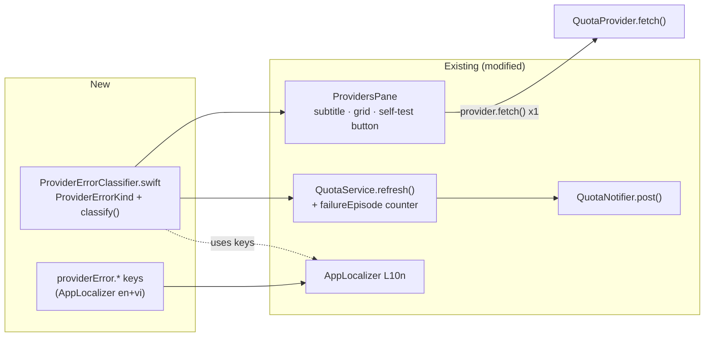
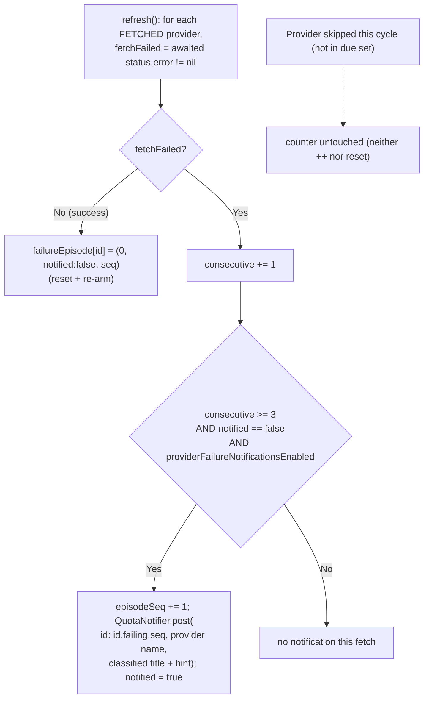

# Design — provider-reliability

**Feature:** macOS-first reliability core (roadmap Phase 7 items 1-3)
**Discovery mode:** light · **Execution tier:** Standard · **Platform:** macOS only
**Date:** 2026-07-07

## 1. Context & Overview

BirdNion polls ~23 AI providers on a shared `QuotaService` loop and renders each in
`ProvidersPane`. Failures today surface as ad-hoc raw strings (`"HTTP 401"`,
`"timeout sau 12s"`, `"Chưa cấu hình token"`) with no remediation guidance, no on-demand
test, and no alert when a provider dies silently.

The design adds a single pure classifier as the shared seam, then plumbs its output into
three surfaces without touching the network layer or the quota-threshold system:

- **R0/R1** — `ProviderErrorClassifier.swift`: `ProviderErrorKind` enum + `classify(rawError:)`
  + per-kind localization keys.
- **R2** — `ProvidersPane`: classified subtitle + detail grid (raw kept in tooltip), plus a
  per-provider self-test button that calls the existing `provider.fetch()` once.
- **R3** — `QuotaService.refresh()`: a fire-once-per-episode failure counter that posts one
  `QuotaNotifier` notification after 3 consecutive failing cycles, reset on recovery.

### Design principles honored
- **KISS/YAGNI:** one pure function + additive state map; no `ReliabilityService`, no
  structured error types on 23 fetchers, no retry/backoff.
- **DRY:** classification lives in one place, consumed by UI + notification + tests.
- **Surgical:** UI + notification edits touch existing files; only the classifier and its
  test are new files (with explicit pbxproj steps).

## 2. Canonical Contracts & Invariants

These are stable across all tasks. Tasks that touch them copy the block verbatim.

<!-- contract:ProviderErrorKind -->
```swift
/// Actionable classification of a provider's raw error string. Pure, UI-free.
/// Order of the cases is NOT significant; the ORDER OF CHECKS in `classify` IS
/// (see the classification precedence invariant below).
enum ProviderErrorKind: String, CaseIterable, Equatable, Sendable {
    case cookieExpiredOrMissing      // browser session cookie missing/expired -> re-login browser
    case tokenInvalidOrMissing       // API key / OAuth token missing/wrong/expired -> re-paste token
    case apiSchemaChanged            // unexpected/invalid response shape or 5xx -> app may need update
    case networkUnreachableOrTimeout // network down / timeout -> check connection, retry
    case rateLimited                 // HTTP 429 / rate-limit -> wait and retry
    case unknown                     // unmatched -> show detail

    /// L10n key for the short title.
    var titleKey: String { "providerError.\(rawValue).title" }
    /// L10n key for the one-line remediation hint.
    var hintKey: String { "providerError.\(rawValue).hint" }
}
```
<!-- /contract:ProviderErrorKind -->

<!-- contract:classify -->
```swift
/// Pure classifier: maps a raw provider error string to exactly one kind.
/// Returns nil when there is no error to classify (nil/empty input).
/// PRECEDENCE (fixed invariant — order of checks matters):
///   1. nil/empty            -> nil                         (R0.7)
///   2. cookie marker        -> cookieExpiredOrMissing      (R0.3, beats 401/403)
///   3. 429 / rate-limit     -> rateLimited                 (R0.4, beats 401/403)
///   4. timeout/network      -> networkUnreachableOrTimeout (R0.5, beats schema)
///   5. 401/403 / token      -> tokenInvalidOrMissing
///   6. invalid-response/5xx -> apiSchemaChanged
///   7. otherwise            -> unknown                     (R0.6)
/// Matching is case-insensitive substring/code containment over the raw string,
/// which is intentionally bilingual (vi/en) and ad-hoc across providers.
func classify(rawError: String?) -> ProviderErrorKind?
```
<!-- /contract:classify -->

**Classification episode / notification invariant (R3):**
- The failure counter is keyed by provider id in a NEW map on `QuotaService`
  (`failureEpisode: [String: (consecutive: Int, notified: Bool, episodeSeq: Int)]`),
  SEPARATE from the existing `warnState`. The quota-threshold system is untouched.
- Threshold `N = 3` consecutive failing *fetches* is a fixed constant
  (`Self.failureNotifyThreshold`). <!-- Updated: Red Team Finding 1 --> "Consecutive"
  counts consecutive failing FETCHES of that provider, not loop cycles: a provider skipped
  on a cycle (per-provider interval throttle keeps it out of the `due` set) neither
  increments nor resets its counter — only an actual fetch result moves it. This makes the
  behavior deterministic regardless of per-provider refresh overrides.
- **R3.5 source-of-truth invariant** <!-- Updated: Red Team Finding 4 -->: the failure
  decision MUST be derived from the awaited `status.error` of THIS fetch. It MUST NOT read
  `pending[id]`, `statuses`, or `displayStatuses` — those may carry a preserved stale good
  snapshot and would mask an ongoing failure. (The awaited `status` is never mutated by the
  stale-preservation branch, so this is a source-selection rule, not an ordering rule.)
- **Failure-notification enablement** <!-- Updated: Red Team Finding 7 -->: failure-transition
  alerts are gated by a DEDICATED flag `providerFailureNotificationsEnabled`
  (UserDefaults, **default true**) — NOT the quota-threshold master toggle
  `QuotaWarnConfig.enabled` (which defaults false). Rationale: the Phase-7 reliability goal
  is "don't let providers die silently", so failure alerts must work out of the box and must
  not be coupled to the separate quota-warning feature the user may never enable. This is a
  single bool, not a new settings subsystem (YAGNI). Delivery still reuses `QuotaNotifier`
  (which honors `QuotaWarnConfig.soundEnabled`/overlay for presentation only).
- **Notification identifier** <!-- Updated: Red Team Finding 3 -->: the `QuotaNotifier`
  request identifier MUST be unique per failure episode, e.g.
  `"\(id).failing.\(episodeSeq)"`, where `episodeSeq` increments each time a NEW episode
  starts (first failure after a reset). A static `"\(id).failing"` id would let
  UNUserNotificationCenter silently replace a still-present prior notification and suppress
  the banner/sound for a genuine second outage.

## 3. Architecture & Data Flow

### 3.1 Component map



### 3.2 Self-test flow (R2.4–R2.8)

```mermaid
sequenceDiagram
    participant U as User
    participant PP as ProvidersPane
    participant P as QuotaProvider
    participant CL as classify()
    U->>PP: click "Self-test" (provider X)
    PP->>PP: selfTestState[X] = .running (disable button)
    PP->>P: await provider.fetch()
    alt fetch throws or status.error != nil
        P-->>PP: error (thrown or ProviderStatus.error)
        PP->>CL: classify(rawError)
        CL-->>PP: kind
        PP->>PP: selfTestState[X] = .fail(kind, raw)
    else success
        P-->>PP: ProviderStatus (renderable)
        PP->>PP: selfTestState[X] = .pass
    end
    Note over PP: inline pass/fail + hint; raw in tooltip
```

### 3.3 Failure-transition notification flow (R3.1–R3.5)



**Where R3 hooks in** <!-- Updated: Red Team Findings 1, 4 -->: inside the
`for await (id, status, elapsed) in group` loop of `refresh()`, which iterates only the
FETCHED (`due`) providers. `fetchFailed` is derived from the awaited `status.error != nil`
(the catch branch already sets `error` on thrown fetches). **Source rule (R3.5):** read the
awaited `status.error` only — never `pending[id]`, `statuses`, or `displayStatuses`, which
may carry a preserved stale good snapshot. Providers skipped by the per-provider interval
throttle are simply not in the loop, so their counter is left untouched (consecutive counts
consecutive *fetches*, not cycles). The episode update is O(1) per provider.

## 4. Detailed Design by Requirement

### R0/R1 — `BirdNion/Services/ProviderErrorClassifier.swift` (new)
- Define `ProviderErrorKind` (contract above) + free function `classify(rawError:)`.
- Matching uses a lowercased copy of the raw string and ordered checks per the precedence
  invariant. Marker sets (**illustrative and non-exhaustive** — the classifier is the single
  source of truth; add markers there as one-liners. Ambiguous single-word markers are
  deliberately excluded per Red Team Finding 8):
  - cookie: `"cookie"`, `"session cookie"`, `"cần auth"`, `"__host-auth"`, `"sessionkey"`
  - rate: `"429"`, `"rate limit"`, `"too many"`, `"quá nhiều"`
  - network/timeout: `"timeout"`, `"network"`, `"mạng"`, `"offline"`, `"could not connect"`
  - token/auth: `"401"`, `"403"`, `"token"`, `"api key"`, `"unauthorized"`, `"chưa cấu hình"`, `"hết hạn"` (excludes bare `"đăng nhập"` and `"expired"` as sole markers — they appear in both cookie and token copy; rely on the more specific tokens + precedence)
  - schema/5xx: `"không hợp lệ"`, `"invalid"`, `"thiếu trường"`, `"missing field"`, `"parse"`, `"json"`, `"không nhận ra"`, `"không có model"`, `"http 500"`, `"http 502"`, `"http 503"`
  - HTTP code extraction <!-- Updated: Red Team Finding 5 -->: match codes only in an HTTP
    context — `"http NNN"`, `"(NNN)"`, `"status NNN"`, or an `NNN` token NOT embedded in a
    longer digit run / decimal (e.g. `"5000 tokens"`, `"0.140.0"`, `"429ms"` must NOT be read
    as HTTP codes). Ordered marker checks (cookie → rate → timeout/network) run BEFORE bare
    HTTP-code inference, so `"timeout sau 429ms"` classifies as network, not rate.
    Where a real HTTP code is found: 429→rate, 401/403→token, 5xx→schema, still subject to
    the cookie/rate/network markers winning where present.
- L10n keys resolved by the VIEW/notification via `L10n.t(kind.titleKey)` /
  `L10n.t(kind.hintKey)` — the classifier itself stays UI-free (R0.2).
- New file ⇒ pbxproj edits for app target AND test target (see R4-01 / R0-01 task).

**Localization (R1) — `BirdNion/Services/AppLocalizer.swift` en+vi tables.** Add keys:
`providerError.cookieExpiredOrMissing.{title,hint}`,
`providerError.tokenInvalidOrMissing.{title,hint}`,
`providerError.apiSchemaChanged.{title,hint}`,
`providerError.networkUnreachableOrTimeout.{title,hint}`,
`providerError.rateLimited.{title,hint}`,
`providerError.unknown.{title,hint}`. Plus self-test UI keys
(`provider.selfTest`, `provider.selfTest.running`, `provider.selfTest.pass`,
`provider.selfTest.fail`, `provider.selfTest.disabled`) and the notification body key
(`notification.providerFailing`). <!-- Updated: Red Team Finding 2 (selfTest.disabled) -->
Example vi/en pairs:
- cookie: vi "Cookie hết hạn — đăng nhập lại trình duyệt" / en "Cookie expired — sign in again in your browser".
- token: vi "Token sai — dán lại API key" / en "Invalid token — re-paste your API key".

### R2 — `BirdNion/Views/Settings/ProvidersPane.swift`
- **Helper (single seam):** add
  `private func classifiedMessage(for err: String) -> String` returning
  `L10n.f("provider.errorPrefix", language, L10n.t(kind.hintKey, language))` (or title+hint)
  where `kind = classify(rawError: err) ?? .unknown`.
- **R2.1 subtitle:** in `statusSubtitle(for:)` replace the raw
  `L10n.providerText(err, ...)` with `classifiedMessage(for: err)` (still truncated to fit
  one line). `statusSubtitleDetail(for:)` continues returning the RAW string for the row
  `.help()` (R2.3 — already wired at line ~320).
- **R2.2 grid:** in `detailInfoGrid(_:)`, the error `infoRow` value becomes the classified
  message; attach `.help(rawError)` to that row (R2.3). **Unknown-kind detail**
  <!-- Updated: Red Team Finding 6 -->: when `classify(rawError:) == .unknown`, the DETAIL
  grid error row shows the RAW error string inline as its value (the generic "xem chi tiết"
  hint points here, so the detail must actually show the detail). The sidebar keeps the
  generic hint + raw tooltip.
- **R2.4–R2.8 self-test button:** add `@State private var selfTestState: [String: SelfTestState]`
  where `enum SelfTestState { case idle, running, pass, fail(kind: ProviderErrorKind, raw: String) }`.
  Render a "Self-test" button in the detail header (next to the reload button) or as a
  grid row. On tap: set `.running` (disable button, R2.8), run one `provider.fetch()`;
  map result → `.pass` / `.fail`; classify the error via the same seam. Inline result label
  shows pass icon or classified hint with `.help(raw)` (R2.7).
- **Provider resolution + disabled providers** <!-- Updated: Red Team Finding 2 -->: the
  detail pane is shown for enabled AND disabled rows, but `quota.providers` holds only the
  live ENABLED list. The self-test action MUST NOT leave the button stuck in `.running` when
  the live instance is absent. Rule: resolve `quota.providers.first { $0.id == row.id }`; if
  `nil` (provider disabled / not in the live list), set
  `selfTestState[id] = .fail(.unknown, <localized "provider disabled — enable to test">)`
  (or a dedicated `provider.selfTest.disabled` message) and NEVER remain `.running`. The
  `.running` state is only entered when a fetch will actually run.

### R3 — `BirdNion/Services/QuotaService.swift`
- Add `private var failureEpisode: [String: (consecutive: Int, notified: Bool, episodeSeq: Int)] = [:]`
  and `private static let failureNotifyThreshold = 3`.
- In the `for await (id, status, elapsed) in group` loop (which iterates only FETCHED/`due`
  providers), compute `let fetchFailed = (status.error != nil)` from the **awaited returned
  status only** (never `pending[id]`/`statuses`/`displayStatuses`) <!-- Updated: Red Team Finding 4 -->.
  Then call a new `private func evaluateFailureEpisode(id:, displayName:, status:)`:
  - success → `failureEpisode[id] = (0, false, seq)` (reset + re-arm; keep `seq`).
  - fail → `consecutive += 1`; if `consecutive >= threshold && !notified && Self.failureNotificationsEnabled`,
    then `episodeSeq += 1` and
    `QuotaNotifier.post(id: "\(id).failing.\(episodeSeq)", title: displayName, body: L10n.f("notification.providerFailing", nil, L10n.t(kind.titleKey), L10n.t(kind.hintKey)))`,
    set `notified = true`. <!-- Updated: Red Team Finding 3 (unique per-episode id) -->
- Providers skipped by the interval throttle are not in the loop, so their counter is
  untouched — "consecutive" means consecutive fetches, not cycles (R3.1)
  <!-- Updated: Red Team Finding 1 -->.
- Keep this SEPARATE from `evaluateWarnings` (R4.3). Reuse `QuotaNotifier` (R3.2).
- **Enablement** <!-- Updated: Red Team Finding 7 -->: gate on a DEDICATED
  `providerFailureNotificationsEnabled` UserDefaults flag, **default true** (add a
  `static var failureNotificationsEnabled: Bool { UserDefaults.standard.object(forKey: "providerFailureNotificationsEnabled") as? Bool ?? true }`
  helper). Do NOT reuse `QuotaWarnConfig.enabled` (default false) — the reliability feature
  must work out of the box. This is a single bool, not a new settings subsystem.

### R4 — Integration + verification
- Ensure classifier is imported/invoked from both `ProvidersPane` and `QuotaService`
  (reachability). Add unit tests for R0 (all kinds + precedence cases) and R3 (episode:
  no-fire before 3, fire once at 3, no re-fire, reset+re-arm on recovery). Full `xcodebuild`
  test pass.

## 5. Requirements Traceability Matrix

| Requirement | Component(s) | Task |
|---|---|---|
| R0.1 kinds + classify | `ProviderErrorClassifier.swift` | R0-01 |
| R0.2 pure/testable | `ProviderErrorClassifier.swift` | R0-01 |
| R0.3 cookie precedence | `classify` precedence | R0-01 |
| R0.4 rate-limit precedence | `classify` precedence | R0-01 |
| R0.5 network/timeout precedence | `classify` precedence | R0-01 |
| R0.6 unknown fallback | `classify` | R0-01 |
| R0.7 nil/empty → nil | `classify` | R0-01 |
| R1.1 titles + hints | `AppLocalizer` keys | R1-01 |
| R1.2 en+vi rendering | `AppLocalizer` en+vi | R1-01 |
| R1.3 unknown generic msg | `AppLocalizer` keys | R1-01 |
| R2.1 subtitle classified | `ProvidersPane.statusSubtitle` | R2-01 |
| R2.2 grid classified | `ProvidersPane.detailInfoGrid` | R2-01 |
| R2.3 raw in tooltip | `ProvidersPane` `.help` | R2-01 |
| R2.4 button present | `ProvidersPane` detail header | R2-02 |
| R2.5 single fetch, no new layer | `provider.fetch()` | R2-02 |
| R2.6 pass state | `ProvidersPane` selfTestState | R2-02 |
| R2.7 fail state + hint | `ProvidersPane` selfTestState | R2-02 |
| R2.8 in-progress + disable | `ProvidersPane` selfTestState | R2-02 |
| R3.1 counter on transition | `QuotaService.evaluateFailureEpisode` | R3-01 |
| R3.2 post at 3 | `QuotaService` + `QuotaNotifier` | R3-01 |
| R3.3 fire once | `failureEpisode.notified` | R3-01 |
| R3.4 reset on recovery | `evaluateFailureEpisode` | R3-01 |
| R3.5 based on fetch result | `refresh()` loop hook | R3-01 |
| R4.1 no-crash | catch behavior | R2-02, R3-01, R4-01 |
| R4.2 perf O(n) | `classify` | R0-01, R4-01 |
| R4.3 no threshold-system change | separate state map | R3-01, R4-01 |
| R4.4 reachability | all surfaces wired | R4-01 |
| R4.5 tests build+pass | `BirdNionTests` | R0-01, R3-01, R4-01 |

## 6. Risk Assessment

<!-- Updated: Red Team 2026-07-07 — Findings 1,2,3,5,7 added below -->

| Risk | Severity | Mitigation |
|---|---|---|
| Stale-snapshot preservation hides ongoing failure from R3 counter | High | R3.5: drive counter off the awaited `status.error` only; never read `pending`/`statuses`/`displayStatuses` |
| "Consecutive cycles" ambiguous under per-provider interval throttle (Finding 1) | High | Defined as consecutive *fetches*; skipped cycles neither increment nor reset — pinned in design §2 + R3.1 + task-R3-01 |
| Self-test on a disabled provider leaves button stuck `.running` (Finding 2) | High | Not-found path sets `.fail`/`provider.selfTest.disabled`, never `.running`; `.running` only when a fetch will run |
| Failure alerts OFF by default via coupled `QuotaWarnConfig.enabled` (Finding 7) | Medium | Dedicated `providerFailureNotificationsEnabled` flag, default true |
| 2nd-episode notification suppressed by UNUserNotificationCenter id dedup (Finding 3) | Medium | Per-episode unique id `"<id>.failing.<episodeSeq>"` |
| HTTP code misfires on digits in tokens/counts (Finding 5) | Medium | Codes matched only in HTTP context; marker checks run before bare-code inference; negative tests |
| Ambiguous raw string matches wrong kind (e.g. "HTTP 401 (cookie)") | Medium | Fixed precedence invariant (cookie > rate > network > token > schema); unit tests pin each ambiguous case |
| New file not added to pbxproj → link failure / test can't import | Medium | R0-01 carries exact PBXBuildFile + PBXFileReference + Sources phase steps for app AND test targets |
| Notification spam on flapping provider | Medium | fire-once-per-episode (`notified` flag), reset only on success |
| Self-test races the background refresh loop | Low | self-test is a local `Task` over one provider, independent of the loop; state keyed per provider; button disabled while running |
| Bilingual markers drift as providers add new strings (Finding 8) | Low | marker lists are illustrative/non-exhaustive; `unknown` fallback keeps UX safe; classifier centralized, ambiguous single-word markers excluded |

## 7. Security & Rollback

- **Security:** no new network calls, no new secret handling, no new permissions. Raw
  errors already surface in the UI today; classification only relabels them. OWASP surface
  unchanged.
- **Rollback:** feature is additive. Reverting the classifier helper calls in
  `ProvidersPane`/`QuotaService` restores raw-string display; the new file + keys are inert
  if unreferenced.

## 8. Test Strategy

- **Unit (R0):** `ProviderErrorClassifierTests` — one assertion per kind from representative
  raw strings, plus precedence cases ("HTTP 401 (cookie)"→cookie, "429"→rate over 401,
  "timeout"→network over schema), plus nil/empty→nil.
- **Unit (R3):** extend `QuotaServicePollingTests` with a stub that fails N times then
  recovers; assert `QuotaNotifier` fires exactly once at the 3rd failing cycle and re-arms
  after a success. (If direct `QuotaNotifier` interception is impractical, assert the
  observable `failureEpisode` transitions via a test seam / injected notifier closure.)
- **Component/build (R2):** SwiftUI has no snapshot harness in-repo; verify by full
  `xcodebuild` build + manual reasoning that classified message + tooltip + button states
  compile and are reachable (R4-01 integration task).

## Unresolved Questions
- None blocking.
